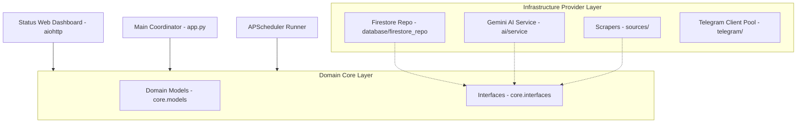
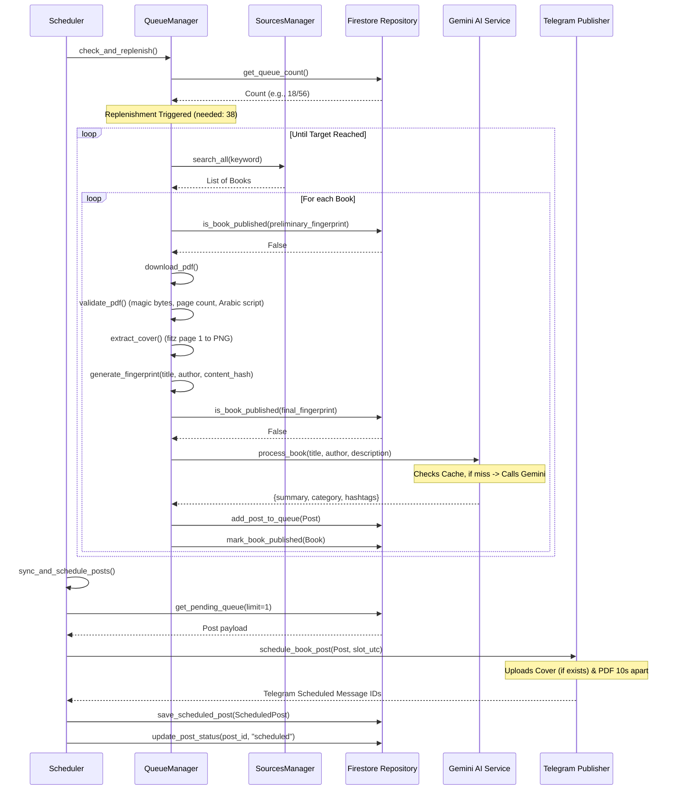

# Architecture Guide - Technical Design

This document details the software design, patterns, and workflows implemented in the **Arabic Books Publisher** application.

## 1. Architectural Patterns

The application is structured according to **Clean Architecture** principles to separate core business logic from external drivers like database providers, scrapers, and Telegram SDKs.

### Key Design Patterns:
1. **SOLID Principles**:
   - **Single Responsibility (SRP)**: Each class/module handles one aspect (e.g. `downloader` handles streaming downloads, `validator` handles PDF parsing, `fingerprint` handles normalization).
   - **Dependency Inversion (DIP)**: High-level queue management does not depend on Firestore or Gemini SDKs directly; it depends on `IBookRepository` and `IAIService` interfaces defined in `core/interfaces.py`.
2. **Provider Pattern**: Scrapers implement the `IBookSource` interface. Adding a new book source requires only writing a new class that implements `search_books` and registering it in `SourcesManager` without modifying core loops.
3. **Repository Pattern**: All database interactions are abstracted via `IBookRepository`. The main scheduler loop is completely unaware of Firestore's structure and can be migrated to SQLite, MongoDB, or PostgreSQL by writing a new repository adapter.
4. **Dependency Injection (DI)**: Classes receive their dependencies via their constructors (e.g., `QueueManager` receives the `IBookRepository`, `IAIService`, and `SourcesManager` instances at initialization in `app.py`).

## 2. Book Processing & Publishing Lifecycle

Here is the sequence of events when a book is scraped, processed, and scheduled:

## 3. Credential Discovery & Failover Flow

The `utils/credentials.py` module manages credentials securely:
- **Discovery**: Scrapes environment variables using regex patterns.
- **Failover**:
  1. Requests a healthy credential.
  2. Executes call.
  3. If exception caught:
     - Flag key based on failure (e.g., `RATE_LIMITED` for 429, `INVALID` for 401/403).
     - Request next key in pool.
     - Retry call.
  4. If all keys fail, returns fallback mock output.
