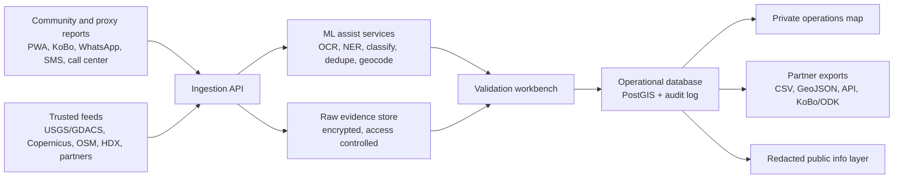

# Product Strategy

## Product Definition

AyudaVenezuela2026 is a humanitarian coordination platform for disaster reports, verified needs, family tracing, and safe public communication.

It is designed as a multi-hazard platform, but the first incident model is the June 2026 Venezuela earthquake response.

## Core Users

- Local NGOs and community organizations.
- Frontline smartphone users acting as proxy reporters for affected residents without devices or connectivity.
- Venezuelan Red Cross and other humanitarian responders where partnership exists.
- Health, WASH, shelter, logistics, and protection teams.
- Civil protection and municipal response actors.
- Diaspora volunteers supporting family tracing and verified donations.
- Journalists and trusted public information channels, through redacted outputs only.

## Product Modules

### 1. Intake

Supported inputs:

- mobile web/PWA form;
- KoBoToolbox/ODK import;
- WhatsApp and Telegram bot/webhook;
- Instagram/Facebook/X screenshot or link capture for validator review;
- SMS/USSD or IVR provider integration where available;
- call-center/manual operator entry;
- CSV/Google Sheet import from partners;
- verified social media capture;
- field team batch uploads.

Core intake fields:

- incident type;
- need category;
- location as free text, GPS, admin area, landmark, or map point;
- time observed;
- source type;
- urgency;
- people affected;
- consent and safety flags;
- contact information, if needed and consented;
- proxy reporter details, when the affected person is not the submitter;
- attachments, if safe to store.

### 2. ML Assist

ML services should be modular and reversible:

- OCR for screenshots and photos of message threads.
- Named entity extraction for names, phones, addresses, landmarks, dates, hospitals, shelters, and organizations.
- Need classification.
- Duplicate clustering.
- Geocoding suggestions using OSM, CODs, local gazetteers, and landmarks.
- Urgency scoring with confidence.
- Translation and transcription assistance.
- Rumor clustering.
- Situation report summarization with citations.

All ML output should be advisory. Validators must be able to edit, reject, merge, and annotate every suggestion.

### 3. Validation Workbench

Validator actions:

- mark duplicate;
- merge records;
- redact public fields;
- request follow-up;
- set verification status;
- assign a responder or cluster;
- update lifecycle state;
- flag safety risk;
- mark stale;
- close as resolved.

Suggested verification statuses:

- unverified;
- plausible;
- duplicate candidate;
- contacted;
- confirmed by partner;
- confirmed by field team;
- contradicted;
- stale;
- unsafe to publish;
- resolved.

### 4. Operations Map

Private layers:

- urgent unverified reports;
- verified needs;
- missing/found person cases;
- unverified connectivity/support-location reports awaiting validation;
- shelters and occupancy;
- health facilities and service capacity;
- WASH points and gaps;
- road/bridge/port/airport status;
- supply points and collection centers;
- partner coverage;
- field team routes;
- aftershock, flood, landslide, or weather overlays.

Public layers:

- verified service points;
- verified connectivity hotspots and charging points;
- safe public shelters, if approved;
- aggregate needs by admin area;
- official instructions;
- vetted donation channels;
- rumor corrections.

### 5. Communications

Communication workflows:

- public updates in Spanish;
- short low-bandwidth updates for WhatsApp/SMS/radio;
- hotspot/support-location updates designed to be reshared as images and short text;
- rumor queue and response status;
- missing-person family updates with privacy controls;
- diaspora donation guidance;
- partner situation reports.

## Technical Architecture

Suggested stack:

- Frontend: Next.js or React PWA, MapLibre/Leaflet, offline caching.
- Field collection: KoBoToolbox/ODK interoperability.
- Backend: API service with queue workers.
- Data: PostgreSQL/PostGIS, object storage for attachments, Redis/queue for jobs.
- Search: OpenSearch/Meilisearch for report lookup.
- ML: Python services using Hugging Face models, strict JSON schemas, model cards, and evaluation sets.
- Auth: role-based access, organization scoping, audit logging.
- Deployment: cloud-hosted coordination instance plus NGO-hostable deployment option.

## Roadmap

### 0-2 Weeks: Crisis Prototype

- Create source register and live situation data model.
- Implement intake schema, validator workflow, and redaction rules.
- Import CODs/OSM/admin boundaries and core health/shelter layers.
- Build a private map with manual CSV upload and lifecycle states.
- Publish a verified, public-safe connectivity/support-location layer for Starlink or other hotspots, charging points, support centers, shelters, clinics, food/water points, and collection centers.
- Create missing-person and urgent-needs triage views.
- Add proxy-reporting flow for frontline smartphone users.

### 2-6 Weeks: Operational MVP

- Add PWA intake, KoBo import, WhatsApp/Telegram intake, and call-center form.
- Add duplicate detection and geocoding suggestions.
- Add role-based access and audit log.
- Add public redacted service map and vetted donation guidance.
- Pilot with 2-3 local/NGO partners.

### 6-12 Weeks: ML And Coordination

- Add OCR, Spanish NER, need classification, and rumor clustering.
- Create evaluation set from human-reviewed records.
- Add SitRep drafting with citations.
- Add exports for clusters and partner tools.
- Run tabletop drills and shadow-mode validation before operational reliance.

### 3-12 Months: Multi-Hazard Expansion

- Add flood/landslide monitoring.
- Add Indigenous-language human-reviewed workflows where partners request them.
- Add community feedback and complaints channel.
- Formalize information-sharing protocol and data protection assessment.
- Train local maintainers and partner admins.

## Evaluation

Evaluate the platform on humanitarian usefulness, not model novelty.

Technical metrics:

- classification precision/recall by need type;
- geocode accuracy by admin level;
- duplicate detection precision/recall;
- latency from report to reviewed record;
- offline sync success rate;
- model calibration and abstention behavior.

Operational metrics:

- time saved in needs assessment;
- reduction in duplicate field visits;
- number of unresolved urgent cases routed;
- coverage of low-connectivity and high-vulnerability areas;
- partner trust and validator override rate;
- public rumor corrections issued and reused.

Safety metrics:

- privacy incidents;
- unsafe publication attempts blocked;
- data retention compliance;
- reports with missing consent;
- sensitive fields accessed outside role scope;
- complaints and takedown requests resolved.
